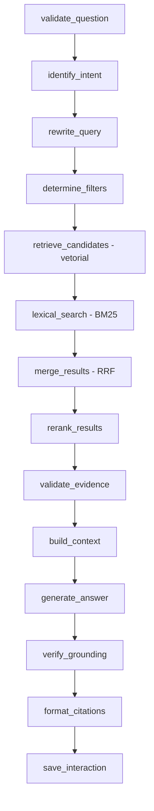

# AxysAI - Respostas para suas dúvidas

Agente de IA corporativo que permite que empresas disponibilizem documentos internos ou
públicos para consulta via linguagem natural, respondendo **exclusivamente com base nos
documentos aprovados**, sempre citando as fontes utilizadas. De uso livre — sem
login/cadastro.

## Sumário

- [Resumo](#resumo)
- [Problema resolvido](#problema-resolvido)
- [Funcionalidades](#funcionalidades)
- [Arquitetura](#arquitetura)
- [Tecnologias](#tecnologias)
- [Formatos de documento suportados](#formatos-de-documento-suportados)
- [Estrutura de pastas](#estrutura-de-pastas)
- [Pré-requisitos](#pré-requisitos)
- [Instalação](#instalação)
- [Configuração (.env)](#configuração-env)
- [Escolha do provedor de LLM](#escolha-do-provedor-de-llm)
- [Uso livre, sem login](#uso-livre-sem-login)
- [Execução](#execução)
- [Docker](#docker)
- [Uso: ingestão de documentos](#uso-ingestão-de-documentos)
- [Uso: chat](#uso-chat)
- [Organizar planilhas](#organizar-planilhas)
- [Perguntas sem documento](#perguntas-sem-documento)
- [Uso: curadoria](#uso-curadoria)
- [Reindexação e novas versões](#reindexação-e-novas-versões)
- [Testes](#testes)
- [Avaliação do RAG](#avaliação-do-rag)
- [Solução de problemas](#solução-de-problemas)
- [Segurança](#segurança)
- [Limitações conhecidas](#limitações-conhecidas)
- [Roadmap](#roadmap)
- [Exemplos de perguntas e respostas](#exemplos-de-perguntas-e-respostas)
- [Exemplos por tipo de empresa](#exemplos-por-tipo-de-empresa)
- [Como adicionar um novo formato de documento](#como-adicionar-um-novo-formato-de-documento)
- [Trocando o banco vetorial](#trocando-o-banco-vetorial)
- [Trocando o provedor de LLM ou embeddings](#trocando-o-provedor-de-llm-ou-embeddings)
- [Integrações documentais futuras](#integrações-documentais-futuras)

## Resumo

O sistema implementa uma arquitetura **RAG (Retrieval-Augmented Generation)** completa:
recebe documentos em 8 formatos diferentes, extrai e limpa o conteúdo, divide em chunks
preservando a estrutura original (página, seção, slide, linha de planilha), gera embeddings,
indexa em um banco vetorial, e responde perguntas combinando busca semântica e lexical,
reranking, e geração de resposta fundamentada com citação de fontes — tudo orquestrado por
grafos [LangGraph](https://langchain-ai.github.io/langgraph/).

## Problema resolvido

Colaboradores frequentemente não sabem onde encontrar uma política, um procedimento ou uma
informação específica espalhada em dezenas de documentos corporativos (PDFs, planilhas,
apresentações, páginas de FAQ). Este agente centraliza a consulta: em vez de procurar
manualmente, o colaborador pergunta em linguagem natural e recebe uma resposta fundamentada,
com a fonte exata (documento, página, seção) para conferência.

## Funcionalidades

- Ingestão de PDF, Word, Excel, PowerPoint, Markdown, CSV, JSON e HTML.
- Pipeline de ingestão completo como grafo LangGraph: validação → extração → limpeza →
  chunking híbrido → metadados → embeddings → indexação vetorial.
- OCR opcional para PDFs escaneados (desativável).
- Deduplicação exata (hash) e detecção de quase-duplicatas (similaridade textual).
- Curadoria: workflow de aprovação/rejeição/arquivamento antes de um documento ser usado nas
  respostas.
- Busca híbrida (vetorial + lexical/BM25) com fusão RRF e reranking (CrossEncoder com
  fallback heurístico automático).
- Agente conversacional em LangGraph: detecção de intenção, reescrita de consulta,
  verificação de fundamentação, citação de fontes, tratamento de perguntas fora de
  escopo/administrativas.
- **Modo de conhecimento geral**: quando nenhum documento relevante é encontrado, o agente
  ainda tenta ajudar com conhecimento geral (em vez de só recusar), sempre deixando claro que
  a resposta não veio dos documentos da empresa — ver
  [Perguntas sem documento](#perguntas-sem-documento).
- **Organizar planilhas pelo chat**: anexar um .xlsx/.csv (na mesma mensagem ou numa
  mensagem separada) pedindo para "organizar"/"limpar" devolve a tabela limpa (linhas/colunas
  vazias e duplicatas removidas) e um botão para baixar o `.xlsx` resultante; gráfico é
  gerado só quando pedido — ver [Organizar planilhas](#organizar-planilhas).
- Proteção estrutural contra prompt injection presente em documentos e na própria pergunta.
- API REST completa (FastAPI), de uso livre — sem login/cadastro (ver
  [Uso livre, sem login](#uso-livre-sem-login)).
- Interface web (Streamlit) enxuta: só **Informações** e **Chat** aparecem no menu — upload
  é feito direto no chat (ícone de clipe), curadoria roda automaticamente. Telas de
  curadoria/configurações/painel continuam existindo (ver
  [Uso livre, sem login](#uso-livre-sem-login)), só não ficam mais visíveis por padrão.
- Camada de abstração de LLM e embeddings — troca de provedor via `.env`, sem alterar código.
- Testes automatizados (227 testes: unitários, integração, segurança) e script de avaliação
  do RAG.

## Arquitetura

### Pipeline de ingestão (`app/ingestion/`)


Qualquer falha em uma etapa é isolada: o documento é marcado como `failed` com a mensagem de
erro registrada, sem interromper o processamento de outros documentos do lote.

### Fluxo do agente RAG (`app/agents/graph.py`)



Qualquer etapa pode desviar diretamente para `save_interaction` com uma mensagem
padronizada: pergunta inválida, fora de escopo, sem evidência, ainda pendente de curadoria,
ou erro do provedor de LLM.

### Camadas da aplicação

```
Streamlit (frontend)  →  API FastAPI  →  Serviços  →  {Documentos, Ingestão, Recuperação, Agente}
                                                              ↓              ↓            ↓
                                                         SQLite (metadados)  Chroma (vetores)
```

O frontend **nunca** acessa o banco de dados diretamente — consome exclusivamente a API REST.

## Tecnologias

| Camada | Tecnologia | Versão testada |
|---|---|---|
| Linguagem | Python | 3.13 (suporta 3.10–3.13) |
| Orquestração LLM | LangChain / LangGraph | 1.3.x / 1.2.x |
| API | FastAPI + Uvicorn | 0.124.x |
| Interface | Streamlit | 1.60.x |
| Validação | Pydantic v2 | 2.13.x |
| Persistência | SQLModel + Alembic + SQLite | — |
| Banco vetorial | Chroma (persistente local) | 1.5.x |
| Embeddings padrão | sentence-transformers (`intfloat/multilingual-e5-base`) | — |
| Reranking padrão | CrossEncoder (`cross-encoder/ms-marco-MiniLM-L-6-v2`) | — |
| Busca lexical | rank-bm25 | — |
| PDF | PyMuPDF | — |
| Word | python-docx | — |
| Excel | openpyxl + pandas | — |
| PowerPoint | python-pptx | — |
| HTML | BeautifulSoup4 + lxml | — |
| OCR (opcional) | pytesseract + pdf2image | — |
| Gráficos (organizar planilha) | matplotlib | — |
| Testes | pytest + pytest-cov | — |
| Lint | ruff | — |

As versões completas e as faixas de compatibilidade estão em `pyproject.toml` e
`requirements.txt`.

## Formatos de documento suportados

PDF (com OCR opcional para páginas escaneadas), Word (.docx), Excel (.xlsx), PowerPoint
(.pptx), Markdown (.md), CSV, JSON e HTML. Ver [Como adicionar um novo
formato](#como-adicionar-um-novo-formato-de-documento) para estender.

## Estrutura de pastas

```
Agente-AI/
├── app/
│   ├── api/            # FastAPI: rotas, dependências, middleware
│   ├── agents/          # Grafo LangGraph do agente RAG, prompts, nós
│   ├── core/             # Configuração, logging, segurança, exceções
│   ├── database/        # Modelos SQLModel, migrations (Alembic)
│   ├── documents/       # Loaders, limpeza, chunking, metadados, validadores
│   ├── embeddings/       # Provedores de embedding (sentence-transformers/OpenAI/Ollama)
│   ├── ingestion/        # Grafo LangGraph do pipeline de ingestão
│   ├── llm/              # Fábrica de modelo de chat, tradução de erros
│   ├── reranking/        # CrossEncoder + fallback heurístico
│   ├── retrieval/        # Busca vetorial/lexical, fusão, status de curadoria
│   ├── services/         # Curadoria, métricas
│   ├── vectorstores/      # Repositório vetorial (Chroma)
│   └── schemas/          # Schemas Pydantic (domínio + API)
├── frontend/streamlit_app/   # Interface web
├── tests/
│   ├── unit/             # Testes unitários por módulo
│   ├── integration/      # Testes ponta-a-ponta (pipeline, API, agente)
│   ├── security/         # Testes de segurança dedicados
│   └── fixtures/         # Documentos fictícios de teste
├── scripts/              # seed_system_user.py, evaluate_rag.py
├── data/                  # Uploads, índice vetorial, banco SQLite, logs (gitignored)
├── .env.example
├── Dockerfile / docker-compose.yml
├── Makefile
├── pyproject.toml / requirements.txt
└── CHANGELOG.md
```

## Pré-requisitos

- Python 3.10 a 3.13.
- Git.
- (Opcional) Docker + Docker Compose, para execução em containers.
- Uma chave de API para o provedor de LLM padrão do projeto, o **Google Gemini**
  (gratuita, obtida em [aistudio.google.com/apikey](https://aistudio.google.com/apikey) —
  não requer instalar nada localmente). Alternativamente, uma chave da Anthropic/OpenAI, ou
  [Ollama](https://ollama.com) instalado localmente para rodar 100% offline.
- (Opcional) Tesseract OCR + Poppler, apenas se for usar OCR de PDFs escaneados.

## Instalação

### Windows (PowerShell)

```powershell
git clone <url-do-repositorio> Agente-AI
cd Agente-AI
python -m venv .venv
.venv\Scripts\Activate.ps1
pip install --upgrade pip
pip install -r requirements.txt
copy .env.example .env
```

### Linux / macOS (bash/zsh)

```bash
git clone <url-do-repositorio> Agente-AI
cd Agente-AI
python3 -m venv .venv
source .venv/bin/activate
pip install --upgrade pip
pip install -r requirements.txt
cp .env.example .env
```

### Banco de dados (todos os sistemas, com o venv ativado)

```bash
python -m alembic upgrade head
python scripts/seed_system_user.py
```

O sistema não tem login/cadastro (ver [Uso livre, sem login](#uso-livre-sem-login)) — o
script de seed cria apenas um usuário "sistema" interno, usado para atribuir uploads,
aprovações, sessões de chat e feedback nas tabelas que exigem essa referência.

## Configuração (.env)

Copie `.env.example` para `.env` e ajuste. Todas as variáveis estão documentadas com
comentários no próprio arquivo. As mais importantes:

```env
LLM_PROVIDER=gemini            # anthropic | openai | ollama | gemini
LLM_MODEL=gemini-flash-lite-latest
GEMINI_API_KEY=coloque-sua-chave-aqui
EMBEDDING_PROVIDER=sentence_transformers   # sentence_transformers | openai | ollama
EMBEDDING_MODEL=intfloat/multilingual-e5-base
VECTOR_STORE_PROVIDER=chroma
APP_SECRET_KEY=troque-por-um-valor-aleatorio
```

A aplicação valida na inicialização se as configurações obrigatórias para o provedor
escolhido estão presentes (ex: `GEMINI_API_KEY` obrigatória quando `LLM_PROVIDER=gemini`) e
falha com uma mensagem clara caso não estejam. **Nunca** inclua chaves diretamente no
código — apenas no `.env` (que nunca é versionado).

## Escolha do provedor de LLM

O padrão do projeto é **Google Gemini** — não exige instalar nada localmente, tem camada
gratuita e responde rápido. Para usá-lo, gere uma chave em
[aistudio.google.com/apikey](https://aistudio.google.com/apikey) e cole em `GEMINI_API_KEY`
no `.env`:

```env
LLM_PROVIDER=gemini
GEMINI_API_KEY=coloque-sua-chave-aqui
LLM_MODEL=gemini-flash-lite-latest
```

Para rodar 100% local e offline (sem depender de nenhuma API externa), use Ollama:

```bash
# instale o Ollama (https://ollama.com) e baixe um modelo
ollama pull llama3.1
```

```env
LLM_PROVIDER=ollama
LLM_MODEL=llama3.1
```

Para usar Anthropic Claude ou OpenAI em vez disso, edite o `.env`:

```env
LLM_PROVIDER=anthropic
ANTHROPIC_API_KEY=sk-ant-...
LLM_MODEL=claude-sonnet-5
```

ou

```env
LLM_PROVIDER=openai
OPENAI_API_KEY=sk-...
LLM_MODEL=gpt-4o-mini
```

Nenhuma alteração de código é necessária — a camada em `app/llm/factory.py` seleciona o
modelo de chat correto automaticamente.

## Uso livre, sem login

Este sistema não tem autenticação, cadastro de usuário nem papéis de acesso — qualquer
pessoa que acesse a interface pode consultar e enviar documentos. É uma escolha deliberada
de arquitetura, não uma limitação: o objetivo é uso livre para todos os testadores, sem
exigir credenciais nem um administrador dedicado gerenciando aprovações. Pelo mesmo motivo,
o menu lateral só mostra **Informações** e **Chat** — Documentos, Curadoria, Configurações e
Painel foram tiradas de vista (ver `app.py`), já que a curadoria roda sozinha e o upload
agora é feito direto no chat.

Implicações diretas dessa escolha:

- **Sem classificação de acesso por usuário**: o campo "classificação de acesso"
  (público/interno/confidencial) continua existindo como metadado do documento, mas não
  restringe mais quem pode ver a resposta — qualquer documento aprovado pode ser citado para
  qualquer pergunta.
- **Curadoria automática por padrão** (`AUTO_APPROVE_ON_UPLOAD=true`): como não há
  administrador dedicado para ficar aprovando/rejeitando manualmente, cada documento
  enviado é aprovado automaticamente assim que termina de processar — passando pela mesma
  máquina de estados e trilha de auditoria (`AuditEvent`) que uma aprovação manual usaria.
  A tela de curadoria (`pages/3_Curadoria.py`) continua existindo e pode ser reativada no
  menu a qualquer momento (edite a lista `pages` em `app.py`) para revisar/rejeitar/arquivar
  algo manualmente. Desligue a variável (`false`) se quiser exigir revisão manual antes de um
  documento responder por perguntas.
- **Atribuição de ações**: uploads, aprovações, sessões de chat e feedback continuam sendo
  registrados no banco (auditoria), atribuídos a um único usuário "sistema" interno (criado
  por `scripts/seed_system_user.py`) em vez de a uma conta individual.
- **Histórico de conversa é local ao navegador**: para não misturar as conversas de pessoas
  diferentes (não há login para diferenciá-las), o histórico exibido na barra lateral do
  Chat vive em `st.session_state` — some se a aba for fechada ou a página recarregada do
  zero. Cada mensagem continua sendo persistida no backend (`ChatSession`/`ChatMessage`)
  para fins de auditoria/avaliação, só não é reapresentada entre sessões de navegador
  diferentes.

Se seu caso de uso precisar de controle de acesso por usuário/departamento no futuro, o
ponto de extensão mais próximo é `app/retrieval/permissions.py` (hoje filtra só por status
de curadoria) — reintroduzir uma dimensão de autorização ali, sem tocar no restante do
grafo do agente.

## Execução

Com o ambiente virtual ativado e o `.env` configurado, em **dois terminais separados**:

```bash
# Terminal 1 — API (backend)
python -m uvicorn app.api.main:app --reload --host 0.0.0.0 --port 8000
# Documentação interativa: http://localhost:8000/docs

# Terminal 2 — Interface web (frontend)
streamlit run frontend/streamlit_app/app.py
# Abre automaticamente em http://localhost:8501
```

Abra `http://localhost:8501` — não é necessário login.

## Docker

```bash
docker compose up --build
```

Isso sobe a API (porta 8000) e a interface Streamlit (porta 8501), aplicando migrations e
criando o usuário "sistema" automaticamente. Para incluir o Ollama como container também:

```bash
docker compose --profile ollama up --build
```

> **Nota:** o Dockerfile/compose foram revisados e validados sintaticamente (YAML e
> instruções de build), mas a build completa da imagem não foi executada neste ambiente de
> desenvolvimento (Docker não estava disponível). Recomenda-se validar o `docker compose up
> --build` no seu ambiente antes de uso em produção.

## Uso: ingestão de documentos

Via interface: não há mais uma página dedicada de upload — envie o documento direto na
página **Chat**, pelo ícone de clipe 📎 ao lado da caixa de pergunta
(`st.chat_input(accept_file=...)`). O processamento (extração, limpeza, chunking,
embeddings, indexação) roda automaticamente em seguida, sem categoria/tags/classificação
(esses campos continuam disponíveis via API para quem precisar deles).

Via API:

```bash
curl -X POST http://localhost:8000/documents/upload \
  -F "file=@politica_reembolso.pdf" \
  -F "category_id=<id-da-categoria>" \
  -F "access_classification=internal"

curl -X POST http://localhost:8000/documents/<document_id>/process
```

O documento fica com status `pending_review` até ser aprovado na curadoria — **somente
documentos aprovados são usados nas respostas do agente**.

## Uso: chat

Via interface (página **Chat** — a única página de uso além de **Informações**) ou API. A
barra lateral do Chat suporta múltiplas conversas em paralelo: **➕ Nova conversa** (abre uma
conversa separada sem perder a atual), lista de histórico para retomar qualquer uma delas,
**🗑️** ao lado de cada item do histórico (apaga aquela conversa) e **🧹 Limpar conversa
atual** (esvazia a conversa aberta no momento).

```bash
curl -X POST http://localhost:8000/chat \
  -H "Content-Type: application/json" \
  -d '{"question": "Qual o prazo para solicitar reembolso?"}'
```

A resposta inclui `citations` (fontes com página/seção/trecho, vazio no modo conhecimento
geral), `grounded` (indicador de fundamentação — `false` no modo conhecimento geral) e
`route` (rota do fluxo: `continue`, `general_knowledge`, `pending_approval`, `conflict`,
`provider_error`, `no_evidence`, etc.).

## Organizar planilhas

Anexe um `.xlsx`/`.csv` pelo ícone de clipe do Chat com um pedido contendo uma palavra como
"organizar", "limpar", "arrumar" ou "formatar" (ex: *"organize essa planilha pra mim"*). O
pedido não precisa vir na mesma mensagem do anexo — a página `1_Chat.py` lembra a última
planilha enviada em cada conversa (`active["last_spreadsheet"]`), então "envie o arquivo" e
"organize essa planilha" podem ser duas mensagens separadas. Em vez de entrar no índice de
RAG, o arquivo vai para `POST /tools/organize-spreadsheet` e volta direto na conversa com:

- Um resumo do que foi ajustado.
- Uma prévia da tabela já organizada (`st.dataframe`).
- Um botão de download com o `.xlsx` resultante.

Por padrão **não** gera gráfico (custo extra sem necessidade na maioria dos pedidos) — só
quando o texto do pedido menciona algo como "gráfico" ou "comparar" (parâmetro
`generate_chart` da rota). Quando pedido, é um gráfico de barras (`st.image`): primeira
coluna categórica como rótulo, primeira coluna numérica como valor, somando quando há
categorias repetidas.

**Ordenação**: o pedido também pode incluir "ordem crescente"/"decrescente", "ordenar por
X" ou "classificar por X" (parâmetro `request_text` da rota, texto livre do usuário).
`_find_mentioned_column` casa o nome de alguma coluna real da planilha contra o pedido,
ignorando acentos/caixa (ex: "ordene por salario" → coluna `Salário`, mesmo sem o acento) e
preferindo o nome de coluna mais específico entre os que casarem; sem nenhuma coluna citada,
usa a primeira coluna como padrão prático (e o resumo sempre avisa quando foi um "chute").
Quando a coluna-alvo já vem formatada como texto (ex.: `"R$ 12.500,50"`), `_numeric_sort_key`
extrai o valor numérico só para decidir a ordem das linhas — os valores originais na planilha
nunca são reescritos. Sem nenhuma palavra de ordenação no pedido, a planilha não é reordenada.

**Formatação de moeda**: pedidos como "formate o salário em reais" aplicam a formatação de
moeda do Excel (`number_format`) na coluna reconhecida — só quando ela já é numérica de
verdade; nesse caso os valores em si nunca mudam, só a exibição no Excel. Se a coluna
identificada não for numérica (ex.: já é texto com "R$" embutido) ou se nenhuma coluna puder
ser identificada no pedido, a formatação **não é aplicada** e isso vira um aviso explícito no
resumo (`result.warnings`) — nunca falha em silêncio.

```bash
curl -X POST http://localhost:8000/tools/organize-spreadsheet \
  -F "file=@planilha_bagunçada.xlsx" \
  -F "generate_chart=true" \
  -F "request_text=organize por ordem crescente de salario e formate em reais"
```

**Por design, essa etapa nunca envolve o modelo de linguagem nem execução de código.**
`app/documents/spreadsheet_tools.py` aplica um conjunto fixo e determinístico de operações
via pandas — remover linhas/colunas totalmente vazias, remover linhas duplicadas, remover
espaços em branco nas bordas de texto e nos nomes de coluna, preencher nomes de coluna
vazios/duplicados de forma previsível, ordenar por uma coluna reconhecida e formatar como
moeda quando aplicável. Não tenta interpretar pedidos mais elaborados ("agrupe por
região e some as vendas") — isso exigiria o modelo gerar e executar código sobre a planilha,
o que o `SYSTEM_PROMPT` do agente proíbe explicitamente (ver [Segurança](#segurança)).

## Perguntas sem documento

Nem toda pergunta precisa de um documento indexado para ser respondida. O grafo do agente
(`app/agents/graph.py`) não trata mais "nenhum documento relevante encontrado" como uma
recusa automática — ele segue até `generate_answer`, e o `SYSTEM_PROMPT`
(`app/agents/prompts/templates.py`) instrui o modelo a responder com conhecimento geral
nesse caso, **sempre deixando explícito que a resposta não veio dos documentos da empresa**.

Dois mecanismos evitam que isso vire uma porta para alucinação:

1. **Limiar de relevância pós-reranking** (`RERANK_MIN_SCORE`, padrão `0.3`): a busca
   vetorial sempre devolve os "vizinhos mais próximos", mesmo quando nenhum é realmente
   relevante — sem esse corte, uma pergunta fora da base ainda receberia um CONTEXTO fraco e
   o agente tentaria responder no modo documento (estrito) em vez de admitir que não achou
   nada e cair no modo conhecimento geral.
2. **Prompt com dois modos bem separados**: o `SYSTEM_PROMPT` deixa explícito que o modo
   documento (CONTEXTO não vazio) e o modo conhecimento geral (CONTEXTO vazio) nunca se
   misturam — havendo qualquer trecho de documento, mesmo insuficiente, a resposta continua
   estritamente restrita a ele (nunca completa a lacuna com conhecimento geral). Só quando
   não há absolutamente nenhum trecho relevante o modelo tem permissão para usar
   conhecimento próprio, e mesmo assim só se estiver razoavelmente confiante — caso
   contrário, a instrução é admitir que não sabe.

## Uso: curadoria

A página **Curadoria** (abas por status, com ações de aprovar/rejeitar/reindexar/arquivar)
não aparece mais no menu — como todo documento é aprovado automaticamente (ver abaixo), o
dia a dia não depende mais dela. O arquivo continua em `pages/3_Curadoria.py` e pode ser
reativado a qualquer momento incluindo-o na lista `pages` de `app.py`. Equivalente sempre
disponível via API: `POST /documents/{id}/approve`, `/reject`, `/reindex`,
`DELETE /documents/{id}`.

**Aprovação automática (padrão):** `AUTO_APPROVE_ON_UPLOAD=true` por padrão — como o sistema
não tem login/administrador dedicado (ver [Uso livre, sem login](#uso-livre-sem-login)),
todo documento é aprovado automaticamente assim que o processamento terminar com sucesso,
sem exigir nenhum clique. A transição de status passa pela mesma máquina de estados e
trilha de auditoria de uma aprovação manual. Desligue (`false`) se quiser exigir revisão
manual antes de um documento responder por perguntas reais.

## Reindexação e novas versões

- **Reindexar** (`POST /documents/{id}/reindex`): reprocessa a versão ativa do documento
  (útil após trocar o modelo de embedding ou corrigir um erro de indexação).
- **Nova versão** (`app.ingestion.service.reingest_document_version`): cria uma nova versão
  do documento preservando o histórico da anterior no banco relacional, mas removendo os
  vetores antigos do índice assim que a nova versão é indexada com sucesso — nunca mistura
  chunks antigos e novos numa mesma resposta.

## Testes

```bash
python -m pytest -q                              # suite completa (227 testes)
python -m pytest --cov=app --cov-report=term -q  # com cobertura (92%)
python -m pytest tests/security -v                # apenas testes de seguranca
python -m ruff check app tests scripts frontend   # lint
```

Os testes de integração usam modelos reais de embedding/reranking (baixados uma vez do
Hugging Face e cacheados localmente) e um `FakeListChatModel` determinístico do LangChain no
lugar de um LLM real, para não depender de rede/chaves de API durante a suite automatizada.

## Avaliação do RAG

```bash
python scripts/evaluate_rag.py --fake   # valida o script sem LLM real
python scripts/evaluate_rag.py          # avaliação real, usa o LLM_PROVIDER configurado
```

Ingere o conjunto de documentos fictícios de `tests/fixtures/documents/`, executa as
perguntas de `tests/fixtures/rag_eval_dataset.json` pelo agente completo, e classifica cada
resposta como `correct`, `partially_correct`, `incorrect`, `no_evidence` ou `wrong_source`,
reportando taxa de fundamentação, taxa de citação e latência média. Roda em banco de dados e
índice vetorial temporários — nunca toca os dados reais da aplicação.

## Solução de problemas

| Sintoma | Causa provável | Solução |
|---|---|---|
| `Configuracao obrigatoria ausente` ao iniciar | Falta variável no `.env` para o provedor escolhido | Confira `GEMINI_API_KEY`/`ANTHROPIC_API_KEY`/`OPENAI_API_KEY` conforme `LLM_PROVIDER` |
| Chat falha com `404 model ... no longer available` | Nome de modelo Gemini fixo foi descontinuado pelo Google | Use um alias sempre atualizado como `LLM_MODEL=gemini-flash-lite-latest` em vez de uma versão especifica |
| Chat retorna `route: provider_error` (usando Ollama) | Ollama não está rodando ou URL errada | `ollama serve` e confira `OLLAMA_BASE_URL` no `.env` |
| Chat sempre responde no modo conhecimento geral (`route: general_knowledge`) mesmo tendo documento relevante | `RERANK_MIN_SCORE` alto demais, ou nenhum documento `approved` sobre o assunto | Confira se o documento esperado esta `approved` (nao so `pending_review`); considere baixar `RERANK_MIN_SCORE` |
| Chat responde no modo documento mesmo sem nada relevante (nunca cai no conhecimento geral) | `RERANK_MIN_SCORE` baixo demais para o reranker em uso | Aumente `RERANK_MIN_SCORE` no `.env` |
| Upload falha com `invalid_file` | Extensão não corresponde ao conteúdo real do arquivo | Verifique se o arquivo não está corrompido/renomeado |
| PDF escaneado não é lido | OCR desativado ou Tesseract não instalado | Instale Tesseract + Poppler e confirme `OCR_ENABLED=true` |
| `pip install` falha em `chroma-hnswlib` | Versão do chromadb `<1.0` tentando compilar no Windows sem Visual Studio Build Tools | Use `chromadb>=1.0` (já é o padrão deste projeto) |
| Erro de bcrypt/passlib | Incompatibilidade `passlib`+`bcrypt>=4.1` | Este projeto já usa `bcrypt` diretamente, sem `passlib` |
| Streamlit não conecta à API | `API_BASE_URL` incorreto | Confira `.env` (local) ou a variável de ambiente do container (Docker) |
| 429 no chat/upload | Limite de requisições por minuto excedido | Aguarde ou ajuste `RATE_LIMIT_PER_MINUTE` no `.env` |
| `ollama pull` falha com "not enough space on disk" | Drive onde ficam os modelos do Ollama sem espaço (padrão: `C:\Users\<usuario>\.ollama`) | Redirecione para outro drive: defina a variável de ambiente `OLLAMA_MODELS` (ex: `D:\OllamaModels`) e reinicie o Ollama |
| Chat falha com erro de CUDA (`shared object initialization failed`, buffer overrun) | Driver NVIDIA/CUDA instável nessa máquina | Force o Ollama a rodar em CPU: defina `OLLAMA_NUM_GPU=0` (e opcionalmente `CUDA_VISIBLE_DEVICES=-1`) antes de iniciar `ollama serve` — mais lento, mas funcional |

## Segurança

- Validação de extensão, MIME/assinatura de conteúdo e tamanho máximo de todo upload.
- Nomes de arquivo em disco sempre gerados (UUID) — nunca reutilizam o nome original enviado.
- Bloqueio de path traversal (`..`, `/`, `\` no nome do arquivo).
- Sistema de uso livre, sem login (ver [Uso livre, sem login](#uso-livre-sem-login)) — o
  controle de acesso aplicado é por status de curadoria, não por identidade de usuário.
- Status de curadoria sempre verificado contra o banco relacional (nunca apenas metadados
  do vetor, que podem ficar desatualizados após uma mudança de status).
- Proteção estrutural contra prompt injection: conteúdo de documento entra na conversa apenas
  dentro de um bloco `CONTEXTO:` claramente delimitado, nunca interpretado como instrução.
- Nenhuma macro, script ou fórmula de planilha é executada — apenas texto/dados são extraídos.
- A ferramenta de organizar planilhas (`/tools/organize-spreadsheet`) usa somente um conjunto
  fixo de operações pandas pré-definidas — o modelo de linguagem nunca gera nem executa
  código sobre o arquivo enviado.
- Logs estruturados nunca incluem texto completo de documento, resposta ou segredos (chaves
  redigidas automaticamente).
- Limitação básica de requisições por IP (janela deslizante em memória).
- Exclusão de documento é lógica (arquivamento) + remoção imediata do índice vetorial —
  nunca apaga o registro do banco (auditoria).
- Trilha de auditoria (`AuditEvent`) para mudanças de status de documento.

Ver `tests/security/` para a suite de testes dedicada (16 testes) que valida estas garantias.

## Limitações conhecidas

- **Validado com Gemini real** (`gemini-flash-lite-latest`) e com **Ollama real** (`llama3.1`,
  modo CPU): pergunta → resposta fundamentada → citação correta, ponta a ponta via API. Com
  Gemini, resposta tipicamente em 3-15s (sem custo de carregar modelo, ao contrário do
  Ollama em CPU). Em GPUs NVIDIA com driver CUDA instável (só relevante para Ollama), force
  a rodar em CPU definindo `OLLAMA_NUM_GPU=0` antes de `ollama serve` (mais lento, mas evita
  o crash do driver) — ver [Solução de problemas](#solução-de-problemas).
- **Configurações somente leitura na interface**: a página Configurações exibe os parâmetros
  efetivos, mas alterá-los requer editar o `.env` e reiniciar — não há persistência de
  configuração em runtime nesta versão (evita simular uma funcionalidade que não gravaria de
  fato).
- **BM25 reconstruído a cada consulta**: adequado para o volume esperado da primeira versão;
  um índice lexical persistente é uma otimização natural para corpora muito grandes.
- **Conectores externos (Google Drive, SharePoint, etc.)**: apenas a interface
  `DocumentSourceConnector` está definida — nenhuma integração real foi implementada nesta
  versão (explicitamente opcional na primeira versão, conforme o prompt mestre).
- **Sem timeout genérico de requisição HTTP**: o timeout é aplicado por chamada ao provedor
  de LLM (`LLM_TIMEOUT_SECONDS`), não há um timeout geral de requisição na API — decisão
  consciente para não interromper uploads/processamentos legítimos de documentos grandes.
- **Docker não testado com build completa** neste ambiente (ver seção Docker acima).

## Roadmap

- Integrações reais com Google Drive, SharePoint, OneDrive e outras fontes corporativas.
- Índice BM25 persistente para corpora de grande escala.
- Configuração editável em runtime, persistida via `AppConfigurationEntry` (tabela já
  existente no schema, ainda não exposta por endpoint de escrita).
- Bots para Microsoft Teams e Slack, reaproveitando os mesmos serviços da API.
- Métricas de uso de tokens por provedor (quando a API do provedor disponibilizar).
- Suporte a pgvector/Qdrant como alternativa de produção ao Chroma (interface
  `VectorRepository` já pronta para isso).

## Exemplos de perguntas e respostas

> Os exemplos abaixo usam dados **fictícios** dos documentos de teste em
> `tests/fixtures/documents/`.

**Pergunta com resposta fundamentada**

```
Usuário: Qual é o prazo para solicitar o reembolso?
Agente: A solicitação deve ser realizada em até 7 dias corridos após a compra.

Fontes:
1. sample_policy.pdf — página 1
```

**Informação ausente**

```
Usuário: A empresa aceita reembolso para compras feitas há mais de 60 dias?
Agente: Não encontrei informações suficientes nos documentos aprovados para responder
com segurança.

Sugestão: entre em contato com o responsável pela categoria ou adicione documentação
oficial sobre esse assunto.
```

**Pergunta sem nenhum documento relacionado (modo conhecimento geral)**

```
Usuário: Qual é a capital da França?
Agente: Não encontrei essa informação nos documentos da empresa, mas a capital da França
é Paris.
```

**Documento relevante ainda não aprovado pela curadoria**

```
Usuário: [pergunta cuja única fonte relevante é um documento recém-enviado, ainda
pending_review]
Agente: Encontrei documentos que parecem relevantes para essa pergunta, mas eles ainda
estão aguardando revisão e aprovação da curadoria. Assim que forem aprovados, poderei
responder com base neles.

Você pode revisá-los na página de Curadoria.
```

## Exemplos por tipo de empresa

O agente é agnóstico ao segmento — a categorização e os documentos ingeridos é que definem o
domínio. Exemplos de documentos/perguntas típicas por tipo de negócio:

| Tipo de empresa | Documentos típicos | Perguntas típicas |
|---|---|---|
| Loja online / e-commerce | Política de privacidade, reembolso, devoluções, FAQ, envios | "Qual o prazo para devolução?" |
| SaaS / plataforma digital | Base de conhecimento, planos e preços, termos de uso | "Qual plano permite mais usuários?" |
| Logística e envios | Política de envios, rastreamento, sinistros | "Como rastrear meu pedido?" |
| Clínica/consultório | Privacidade do paciente, convênios, reagendamento | "Quais convênios são aceitos?" |
| Plataforma educacional | Regimento, certificados, bolsas | "Como emitir certificado?" |
| Fintech/banco digital | Privacidade, limites, antifraude, tarifas | "Qual o limite diário de transferência?" |

> Para os segmentos de saúde e finanças, o agente é instruído a **não fornecer
> diagnóstico/orientação clínica ou aconselhamento financeiro** além do conteúdo
> documental estritamente citado.

## Como adicionar um novo formato de documento

1. Crie um novo arquivo em `app/documents/loaders/`, implementando a interface
   `DocumentLoader` (`app/documents/loaders/base.py`): métodos `supports(file_path)` e
   `load(file_path) -> ExtractedDocument`.
2. Registre o novo loader em `app/documents/loaders/registry.py` (lista `_LOADERS`).
3. Adicione a extensão em `ALLOWED_EXTENSIONS` no `.env` e em
   `_EXTENSION_TO_FORMAT` (`app/ingestion/service.py`), e um novo valor no enum
   `DocumentFormat` (`app/database/models/enums.py`) — gera uma nova migration Alembic
   (`alembic revision --autogenerate -m "novo formato X"`).
4. Adicione testes em `tests/unit/documents/` com um fixture pequeno em
   `tests/fixtures/documents/` (gerado por `tests/fixtures/generate_fixtures.py`).

Nenhum outro ponto do sistema precisa mudar — chunking, embeddings, indexação e recuperação
já operam sobre a saída padronizada (`ExtractedDocument`/`DocumentSection`).

## Trocando o banco vetorial

A interface `VectorRepository` (`app/vectorstores/base.py`) já isola toda a lógica de
recuperação do backend concreto. Para adicionar, por exemplo, pgvector: implemente uma nova
classe `PgVectorRepository(VectorRepository)`, registre-a em `app/vectorstores/factory.py`
para o valor `VECTOR_STORE_PROVIDER=pgvector`, e adicione o novo valor ao enum
`VectorStoreProvider` em `app/core/config.py`. Nenhum outro módulo (`retrieval/`, `agents/`,
`ingestion/`) precisa ser alterado.

## Trocando o provedor de LLM ou embeddings

Basta alterar `LLM_PROVIDER`/`EMBEDDING_PROVIDER` no `.env` (seção [Escolha do provedor de
LLM](#escolha-do-provedor-de-llm)). Para adicionar um provedor totalmente novo, implemente
`BaseEmbeddingProvider` (`app/embeddings/base.py`) ou use diretamente uma classe
`BaseChatModel` do LangChain em `app/llm/factory.py`.

> **Atenção:** trocar o modelo de embedding exige reindexar todos os documentos — vetores de
> modelos diferentes não são comparáveis. O sistema registra o modelo/dimensão usados em
> `EmbeddingIndexVersion` para rastrear isso.

## Integrações documentais futuras

A interface `DocumentSourceConnector` (documentada no prompt mestre, seção 6) está prevista
na arquitetura mas não implementada nesta versão — apenas upload manual e pipeline de
processamento estão disponíveis. Para adicionar uma fonte externa (Google Drive, SharePoint,
etc.), implemente essa interface e um novo serviço em `app/services/` que chame
`app.ingestion.service.ingest_new_document` para cada documento listado pelo conector.
